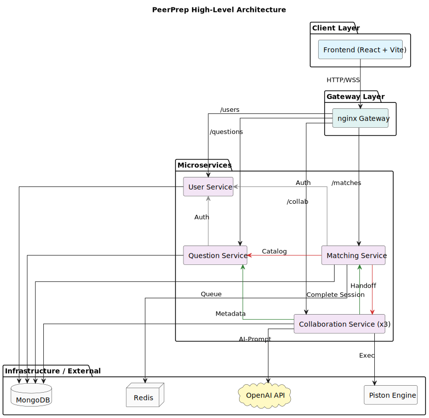

[](https://classroom.github.com/a/HpD0QZBI)

# CS3219 Project (PeerPrep) — AY2526S2, Group G17

PeerPrep is a technical interview preparation platform that matches students in real time to solve coding problems together. A user logs in, chooses a difficulty level and topic, and is paired with another online user with the same preference. Once matched, both users enter a shared session with a collaborative code editor, a built-in code runner, chat, voice, and optional AI assistance — then finish with a reviewable attempt history.

## What the Platform Does

- **Authenticate and manage users.** Email + password, Google OAuth, and GitHub OAuth sign-in. Users have profile photos, editable profiles, and can request admin privileges.
- **Match peers in real time.** Users queue for a difficulty and topic; a Redis-backed matcher pairs them and relaxes difficulty if no match is found within a time window.
- **Collaborate on a question.** Matched users share a Monaco editor synchronised with Yjs CRDTs, so concurrent edits never conflict.
- **Run and submit code.** The collaboration service executes Python against visible and hidden test cases in a sandboxed Piston runner and returns verdicts (AC, WA, TLE, MLE, RE).
- **Talk while solving.** Real-time text chat (Socket.IO) with reactions and typing indicators, plus a WebRTC voice call.
- **Get AI help.** OpenAI-backed endpoints explain code, clarify the question, and suggest improvements after an attempt.
- **Review past sessions.** Every attempt is saved with code snapshots, verdict, and the partner — browsable on a history page.
- **Administer the platform.** Admins manage users, review role-upgrade requests, and seed or manage the question bank through a dedicated dashboard.

## Architecture



PlantUML source: [docs/architecture.puml](docs/architecture.puml)

Four independent microservices sit behind an nginx gateway on port 80. Services communicate over REST and are isolated � each owns its own models and persistence boundary.

| Service                   | Port  | Responsibility                                                       |
| ------------------------- | ----- | -------------------------------------------------------------------- |
| frontend                  | 5173  | React 19 + Vite SPA                                                  |
| user-service              | 8081  | Auth (JWT + OAuth2 Google/GitHub), profiles, roles, photos           |
| question-service          | 8080  | Question CRUD, seeding, execution metadata, hidden test cases        |
| matching-service          | 8082  | Matchmaking queue (Redis), WebSocket match events, timeouts          |
| collaboration-service × 3 | 8083  | Yjs editor sync, chat, voice signalling, code execution, AI, history |
| nginx                     | 80    | Reverse proxy, consistent hashing for sticky collab sessions         |
| MongoDB                   | 27017 | Shared datastore (each service owns its collections) + GridFS        |
| Redis                     | 6379  | Match queue, pub/sub event bus, distributed session locks            |
| Piston                    | 2000  | Sandboxed Python execution                                           |

**Request routing (via nginx):**

- `/api/users` → user-service
- `/api/questions` → question-service
- `/api/matches` + `/ws/matches` → matching-service
- `/api/collab/*` + `/ws/sessions/`, `/ws/chat/` → collaboration-service (consistent hashing keeps a session pinned to one instance)

## Tech Stack

- **Frontend:** React 19, Vite, TypeScript, Tailwind CSS v4, shadcn/UI, Monaco Editor, Yjs, Socket.IO client
- **Backend:** Node.js 20, Express, TypeScript, Mongoose
- **Real-time:** Yjs + y-websocket (editor), Socket.IO (chat), WebRTC (voice), ws + ioredis (matching)
- **Auth:** Passport.js (Google, GitHub), JWT, bcrypt
- **Code execution:** Piston (sandboxed Python 3.10 runner)
- **AI:** OpenAI GPT for explanations, hints, and attempt suggestions
- **Infra:** Docker Compose, nginx (load-balanced collaboration service)
- **Testing:** Vitest + Testing Library (frontend), Playwright (E2E), Node test runner + supertest + mongodb-memory-server + ioredis-mock (backend), c8 coverage

## Run Everything with One Command (Docker)

From the repository root:

```bash
make start
```

Then open:

- **Local:** http://localhost
- **Network (other devices):** http://<YOUR_IP> (e.g. http://192.168.x.x)

All services are proxied through nginx on port 80, so you do not need to access individual service ports directly.

Stop everything:

```bash
make stop
```

To also remove the MongoDB data volume:

```bash
make clean
```

## User Service Admin Bootstrap

Newly registered users are created with role `user` by default. To bootstrap the first admin in a fresh environment:

```bash
cd services/user-service
npm run bootstrap-admin -- --email <existing-user-email>
```

Notes:

- The target account must already exist.
- The command promotes the specified account to `admin`.
- If the user is not found, the command exits with a non-zero status.

## Matching Service

The matching backend lives in `services/matching-service`.

- REST base URL: `http://localhost/api/matches`
- WebSocket path: `ws://localhost/ws/matches`
- Match status events: `searching`, `matched`, `timed_out`, `cancelled`
- Matching relaxes difficulty constraints after a timeout window to keep queues moving.

Redis backs the matchmaking queue and pub/sub event bus; MongoDB persists session history.

## Collaboration Service

The collaboration backend lives in `services/collaboration-service`.

- REST base URL: `http://localhost/api/collab/sessions`
- Handoff endpoint (internal, called after a match): `POST /api/collab/sessions/handoff`
- WebSocket (Yjs editor): `ws://localhost/ws/sessions/`
- WebSocket (chat): `ws://localhost/ws/chat/`
- Code execution: `POST /api/collab/sessions/:sessionId/run` (visible tests) and `/submit` (all tests, incl. hidden)
- AI endpoints: `/explain`, `/assistant/question`, `/history/suggestion`

Session page flow in the frontend:

- `http://localhost/match`
- `http://localhost/collaboration/:sessionId`

Three collaboration-service replicas run behind nginx with consistent hashing, so all traffic for a given session lands on the same instance.

## Repository Layout

```
peerprep-g17/
├── frontend/              React 19 + Vite SPA
├── services/
│   ├── user-service/      Auth, profiles, roles, OAuth
│   ├── question-service/  Question bank, seeding, execution metadata
│   ├── matching-service/  Matchmaking queue, WebSocket events
│   └── collaboration-service/  Yjs editor, chat, voice, code runner, AI, history
├── tests/                 Playwright E2E + non-functional (load, failure injection)
├── ai/                    AI usage log and prompts
├── docker-compose.yml     Development stack
├── nginx.conf             Gateway routing + consistent hashing
├── Makefile               start / stop / clean / logs helpers
└── TESTING.md             Testing strategy and CI matrix
```

## Declaration of Use of AI Tools

AI Use Summary

Tools: ChatGPT

Prohibited phases avoided:

- Requirements elicitation and prioritization were not outsourced to artificial intelligence.
- Architecture and design decisions were made by the team.
- Decision rationales and trade-off justifications were written by the authors.

Allowed uses:

- Generate: Boilerplate for Google OAuth integration, frontend login UI, collaboration chat UI components, profile image selection support and chat feature enhancements such as snippet display and code-copy interactions.
- Refactor: Styling and UI revisions for frontend pages such as `HistoryPage.tsx`, with generated suggestions adapted to the existing codebase and design.
- Debug: Assistance with intermittently failing collaboration-service CI test cases and race conditions in async collaboration tests.
- Explain: Used to understand failing CI behavior and test race conditions before applying code-level fixes.

How Each Tool Was Used

| Tool    | Mode                               | Scope                                                                                                                                                                                                                                       |
| ------- | ---------------------------------- | ------------------------------------------------------------------------------------------------------------------------------------------------------------------------------------------------------------------------------------------- |
| ChatGPT | Generate, Refactor, Debug, Explain | Used for frontend boilerplate, UI improvements, profile image support, collaboration chat enhancements, CI test debugging and explanation of failing async test behavior. All outputs were reviewed and edited by the authors before usage. |

What AI was not used for:

- Architecture/design decisions: System design choices, service boundaries, collaboration design and infrastructure trade-offs were decided by the team.
- Core algorithm design: Matching behavior, collaboration session behavior and other core logic decisions were implemented and validated by all team members.
- Requirements elicitation: Feature requirements were derived from the project brief and team discussions.

Verification:

- All AI-assisted outputs were reviewed, edited and tested by the authors before acceptance.
- No AI-generated output was relied upon without author validation against the project's existing architecture, code patterns and testing workflow.

Prompts and key exchanges:

- Please feel free to see [ai/usage-log.md](ai/usage-log.md) for the full timestamped log of AI interactions, prompts, output summaries, actions taken and author notes.


